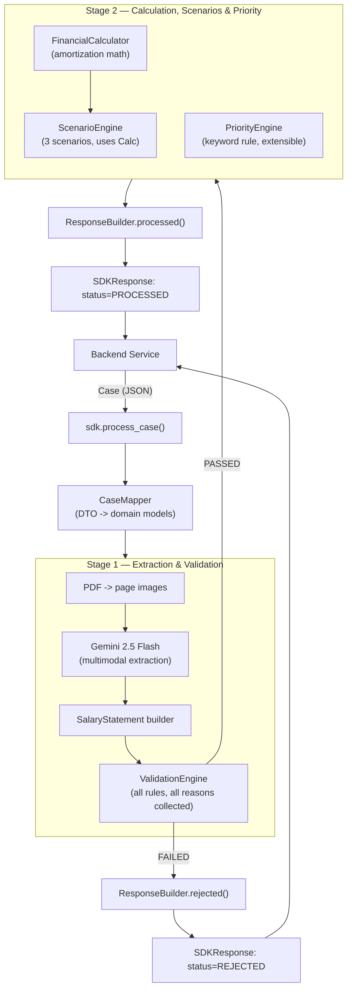
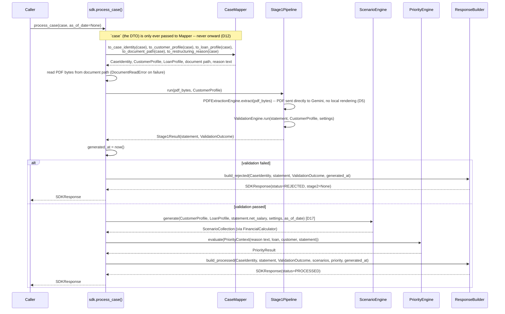
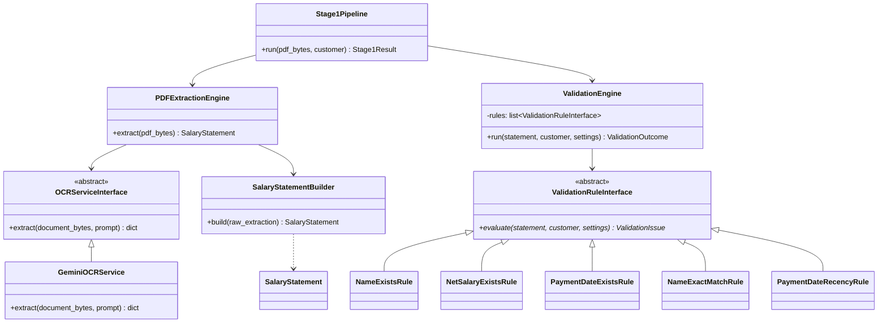
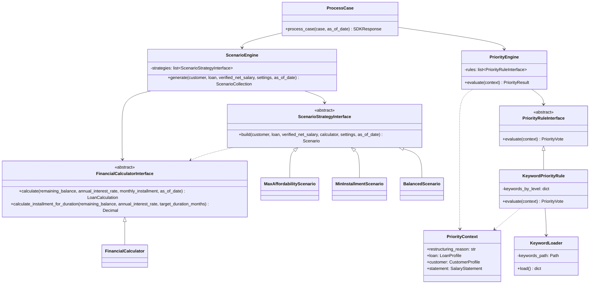

# Software Design Document: AI Loan Restructuring SDK

| | |
|---|---|
| **Status** | Implemented — Hackathon MVP complete, all stages done (§11 Phase 6), post-implementation audit passed (v3.1) |
| **Author** | Claude Code (drafted with bashyamen1@gmail.com) |
| **Date** | 2026-07-21 |
| **Version** | 3.1 — supersedes v0.1 ("Salary Statement Verification SDK"), which described an earlier, narrower version of this project and should be treated as obsolete |

---

## 0. Change note

v0.1 of this document designed a standalone salary-statement verification library (fuzzy name
matching, `pdfplumber` text extraction, no loan logic). That scope is superseded. This SDK is now
an **AI Loan Restructuring SDK**: given a full loan-restructuring case from a backend system, it
extracts and validates a salary statement (via Gemini 2.5 Flash, multimodal), then — only if
validation passes — computes three amortized restructuring scenarios and a priority level. This
document is a ground-up redesign, not a patch of v0.1.

**v2.1** tightens the DTO/domain-model boundary first introduced as D10. Implementation review
found `ResponseBuilderInterface` still accepting the raw `Case` DTO (to read `case_id` /
`application_number`) — a real gap, since the Response Builder is the last pipeline stage and had
no business reason to know the backend's API shape. Fixed by adding a `CaseIdentity` domain model
and expanding `CaseMapper` to cover every field any downstream module needs, so `Case` now exists
*only* inside `mapping/case_mapper.py` and at `sdk.py`'s single entry point. See D12.

**v2.2** records that Stage 1 (Gemini integration, extraction layer, validation engine, and a
Stage-1-only response builder) is implemented and passing its unit tests. Two things changed from
the v2.0/2.1 design as written:

- **D5 is corrected, not just implemented.** The original text said "PDF → page images → Gemini,"
  and D11 picked PyMuPDF for that rendering step. On implementation, the explicit instruction was
  to send the PDF **directly** to Gemini as multimodal inline data — Gemini 2.5 Flash has native
  PDF understanding, so a local page-rasterization step is unnecessary local processing, not just
  redundant. `PDFToImageConverterInterface`/`PyMuPDFImageConverter` and the `pymupdf` dependency
  were removed rather than left unused. D5 and D11 below are updated to reflect this.
- **A `Stage1Pipeline` class and a `Stage1ResponseBuilder` were added**, not present in the v2.0
  file tree. `ResponseBuilderInterface` (§5.5) requires `ScenarioResult`s/`PriorityResult` that
  don't exist until Stage 2 is built, so it can't yet produce a real response. `Stage1Pipeline`
  (`stage1_pipeline.py`) composes the Extraction and Validation Engines into a single, independently
  testable Stage-1-only unit; `Stage1ResponseBuilder` (`response/stage1_response_builder.py`)
  builds the Stage-1-only result shape (§5.3's `Stage1Result`, reused as-is — no new response model
  needed). See D13. `sdk.py`'s `process_case()` remains unimplemented until Stage 2 exists, since
  it composes both stages.

Also flagged: §4's file tree still describes the `stage1_extraction_validation/`/
`stage2_calculation/` nested-package layout from the original draft. The code actually implements
the flatter `ocr/` / `extraction/` / `validation/` / `scenarios/` / `priority/` / `response/` /
`api/` layout requested in a later review pass (plus `mock_backend/` as a sibling package, outside
the SDK). §4 has not been re-rendered to match — treat the code layout as authoritative for
folder structure; this document's diagrams and contracts (§5 onward) are what's kept in sync.

**v2.3** implements the Financial Calculator (Stage 2A) — see §6 (rewritten to match, since the
implementation corrects rather than just fills in the v2.0 draft's math description) and D14. Two
decisions worth flagging up front:

- **The calculator got its own top-level package, `financial_calculator/`**, not
  `scenarios/financial_calculator.py` as originally scaffolded. §4/§9(D-notes) had bundled it
  under the Scenario Engine's package; this stage's explicit "completely independent" requirement
  made that placement misleading even though nothing there actually imported scenario code. The
  old `scenarios/financial_calculator.py` and `scenarios/base.py`'s local
  `FinancialCalculatorInterface` were deleted/moved rather than kept as an unused duplicate; every
  file that referenced the old location (`scenario_engine.py`, the 3 strategy stubs,
  `api/dependencies.py`) was updated to import from the new location. Independence is now
  something you can verify with a grep, not just a comment (§9 D14).
- **No month-by-month simulation loop**, contrary to §6's v2.0 draft. "Do not use brute-force
  searching" ruled that out; the implementation solves for both the duration and the final
  (smaller) payment via closed-form formulas instead — see §6 for the exact derivation. Tests
  cross-check this against an intentionally naive month-by-month loop (test code only, never
  production code) rather than trusting the closed form blind.

**v2.4** implements the Scenario Engine (Stage 2B) — see §6.1 (new) and D15/D16. Notable outcomes:

- **`FinancialCalculatorInterface` gained a second operation**, `calculate_installment_for_duration`
  — the algebraic inverse of `calculate()`'s duration-solving step, needed for Scenario 2. Also
  closed-form (the standard annuity-payment formula), rounded *up* to the nearest cent rather than
  to nearest, to guarantee the 96-month cap holds even after cents-quantization (§6.1).
- **`ScenarioResult` is renamed `Scenario`**, and its amortization fields became nullable, to
  represent a scenario the calculator couldn't compute (`feasible=False`) without needing sentinel
  values. A new `ScenarioCollection` model wraps `list[Scenario]` with `min_length=3, max_length=3`
  enforced by Pydantic — "always exactly three" is now a construction-time guarantee, not just
  convention. Every reference to the old name (`response/base.py`, `response/response_builder.py`,
  `models/response.py`) was updated so the package still imports cleanly.
- **`ScenarioStrategyInterface.build()` / `ScenarioEngineInterface.generate()` gained an
  `as_of_date: date` parameter**, with no default — the original v2.0 scaffold never threaded a
  date through at all, which would have forced a hidden `date.today()` inside the engine,
  contradicting the same determinism principle §6 already established for the calculator.
- ~~Open question §12.1 (net salary source of truth) is now implicitly answered by the
  interface~~ — flagged in v2.4 as an unresolved gap: `MaxAffordabilityScenario` was reading
  `CustomerProfile.net_salary`, i.e. the backend DTO's reported figure, not Stage 1's
  Gemini-extracted/validated value. **Explicitly decided otherwise in v2.5 — see below.**

**v2.5** resolves §12.1 explicitly, by stakeholder decision rather than by interface default:
**Stage 1's verified net salary is the sole source of truth for every salary-driven restructuring
calculation; the backend's reported net salary is reference metadata only, never used in
calculations.** Concretely:

- `CustomerProfile.net_salary` is renamed `reported_net_salary`, with a docstring that says, in
  effect, "do not use this for math" — a rename, not just a comment, so misuse doesn't compile
  silently.
- `ScenarioStrategyInterface.build()` and `ScenarioEngineInterface.generate()` gained a required
  `verified_net_salary: Decimal` parameter. All three strategies now read this instead of
  `customer.reported_net_salary` (D17).
- Since there's no `Stage2Pipeline`/`process_case()` yet to wire this for real, a new test
  (`tests/unit/test_stage1_to_stage2_salary_handoff.py`) demonstrates the intended handoff
  end-to-end: run `Stage1Pipeline`, then feed `Stage1Result.statement.net_salary` — not
  `CustomerProfile.reported_net_salary` — into `ScenarioEngine.generate()`. Every scenario test
  also now uses a deliberately different "decoy" reported salary from the verified one, so a test
  would fail loudly if a strategy ever fell back to the wrong value (see D18).
- `Stage1Result.statement` is only non-`None` once `validation.passed` is `True` (already true of
  `Stage1ResponseBuilder`, unchanged) — so `statement.net_salary` is guaranteed present by the time
  a caller is ready to invoke the Scenario Engine; no additional null-handling was needed at the
  Scenario Engine boundary.

**v2.6** implements the Priority Engine (Stage 3) — see D19/D20. `PriorityEngineInterface`,
`PriorityEngine`, `PriorityResult`, and `KeywordPriorityRule` already existed as stubs from the
earlier scaffolding pass; this stage filled in their bodies plus one addition not in the original
scaffold:

- **A new `KeywordLoader` class** (`priority/keyword_loader.py`) owns reading and validating
  `priority_keywords.json` — file-not-found, unreadable, invalid-JSON, and wrong-shape (non-list,
  non-string-list) are all raised as a new `KeywordConfigurationError` (`utils/exceptions.py`).
  `KeywordPriorityRule` takes a `KeywordLoader` (constructing a default one if none is given) and
  loads keywords once, at construction time — a broken config file fails fast during DI wiring
  (`api/dependencies.py`), not on the first request. Separating the loader from the rule is what
  makes "the keyword configuration can be replaced without changing the engine implementation" a
  literal, testable claim: tests inject a `KeywordLoader` pointed at a throwaway file instead of
  touching the shipped config or `KeywordPriorityRule` itself.
- **`PriorityEngine.evaluate()`** runs every configured rule, then picks the highest level among
  votes that actually fired (`level is not None`), defaulting to `LOW` when nothing fires or no
  rules are configured at all — this single default also implements the explicit "if no keyword
  matches, return LOW" requirement, rather than needing separate handling in the rule.
- **`priority_keywords.json` is now populated** with the HIGH/MEDIUM/LOW Arabic keyword lists
  supplied directly as part of this stage's spec, resolving open question §12.7.
- Naming correction: §4's file tree and §8's class diagram (both written before Stage 1/2
  implementation) call these classes `BasePriorityRule` and reference `priority/engine.py`. The
  actual implementation — already in place from the earlier scaffolding pass and left as-is here —
  is `PriorityRuleInterface`/`PriorityEngineInterface` in `priority/base.py`, and the engine lives
  in `priority/priority_engine.py`. §8's diagram is corrected below; §4's tree retains the disclaimer
  from v2.2 that code, not this stale diagram, is authoritative for file layout.

**v3.0** implements the final SDK pipeline (Stage 4 / roadmap Phase 6): `process_case()` is now the
SDK's single, fully working public entry point, composing every previously-independent piece —
`CaseMapper`, `Stage1Pipeline`, `ScenarioEngine`, `PriorityEngine`, `ResponseBuilder` — end to end.
No new business logic was introduced this stage; every engine's actual math/matching/validation
behavior is unchanged from v2.6. What changed is composition and two small, explicitly-justified
interface corrections found while wiring the pieces together:

- **`CaseMapper` is fully implemented** (all 5 methods) — the only class in the SDK allowed to read
  a `Case` DTO's fields (D10/D12), confirmed by grep: `models.case_dto` is imported only by
  `mapping/case_mapper.py`, `mapping/base.py` (interface typing), `sdk.py` (the facade boundary),
  `api/schemas/request.py` (the API boundary), and `mock_backend/` (a sibling package simulating the
  backend, outside the SDK entirely) — nothing else. `to_document_path()` resolves a `Case`
  document's relative `file` reference against the repo root and returns an absolute path;
  `process_case()` itself reads the bytes (`Path.read_bytes()`, wrapped as `DocumentReadError` on
  failure) — file I/O isn't a DTO-shape concern, so it stays out of the Mapper.
- **`process_case()` composes `Stage1Pipeline` directly**, rather than duplicating Stage 1's
  extract-then-validate logic inline. `LoanRestructuringSDK`'s constructor now takes a
  `stage1_pipeline: Stage1Pipeline` instead of separate `extraction_engine`/`validation_engine`
  parameters — `Stage1Pipeline` already existed specifically to be reused this way (its own v2.2
  docstring said as much). If Stage 1 fails validation, `process_case()` returns immediately via
  `ResponseBuilder.build_rejected()`; only on success does it proceed to Stage 2.
- **No separate `Stage2Pipeline` class was introduced (D22).** §11's roadmap (Phase 5c) had
  originally sketched one, mirroring `Stage1Pipeline`. On implementation this was decided against:
  this stage's explicit instruction was for `process_case()` itself to become "the single public
  entry point," directly composing the Scenario Engine and Priority Engine — adding a second
  orchestration layer between `process_case()` and those two engines wasn't requested and would have
  been pure indirection, since (unlike Stage 1) there's no independent-of-`process_case()` reuse
  case for "Scenario Engine + Priority Engine, together, without a Response Builder."
- **`ResponseBuilderInterface.build_rejected()`/`build_processed()` gained a required
  `generated_at: datetime` parameter (D21)**, discovered missing while wiring `process_case()`: the
  interface (designed back in Stage 2B) had no way to express the response's timestamp, which would
  have forced `ResponseBuilder` to call `datetime.now()` internally. `process_case()` now computes
  `generated_at` once, right after Stage 1 completes, and passes it to whichever builder method it
  calls — keeping `ResponseBuilder` a pure function of its inputs, the same principle `as_of_date`
  already established for the Financial Calculator and Scenario Engine (D16).
- **`POST /cases/process`** (`api/routers/cases.py`) is implemented: delegates straight to
  `sdk.process_case()`, then validates the result against `ProcessCaseResponse` (already scaffolded
  as an `SDKResponse` alias, confirming that model didn't need a separate `ProcessCaseResult` type —
  this stage's spec used that name generically for "the strongly-typed result of processing a case,"
  which `SDKResponse` already was).
- **Dead code removed**: `utils/datetime_utils.days_between()` was scaffolding left over from the
  original "empty classes/interfaces" pass and was never called by any rule or engine (confirmed by
  grep — `PaymentDateRecencyRule` computes the age itself via plain `date` subtraction); deleted
  rather than implemented for a caller that doesn't exist. Its module docstring's claim that the
  recency rule uses this module was also stale (it doesn't; only the Financial Calculator's
  `add_months` is actually shared) and has been corrected.
- **Full project audit performed** (this stage's explicit requirement) — see the "Project Audit"
  paragraph below for results: no dead code, no obsolete interfaces, no duplicated models, no unused
  declared dependencies, zero remaining `NotImplementedError` outside `ABC` method stubs (the
  conventional, required body for an `@abstractmethod`, not unfinished work — every one has exactly
  one concrete implementation, enumerated below), and the DTO boundary (D10/D12) holds by grep.
- **Test suite**: 155 tests passing (145 unit + 10 new integration tests under
  `tests/integration/test_end_to_end.py`), 0 skipped, 0 failed — the 12 previously-skipped stub
  tests (`test_sdk.py`, `test_case_mapper.py`, `test_response_builder.py`, `test_cases_router.py`,
  `test_end_to_end.py`) are now real, passing tests. Integration tests mock only the Gemini HTTP call
  (at the same `httpx.AsyncClient.post` boundary `test_gemini_ocr_service.py` already mocks); every
  other component — `CaseMapper`, `Stage1Pipeline`'s real validation rules, `ScenarioEngine`'s real
  `FinancialCalculator`, `PriorityEngine`'s real `priority_keywords.json` — runs exactly as it would
  in production, including reading real bytes off one of the 7 sample PDFs in `Salary_Statement/`.

**Project audit** (performed as part of this stage, per its explicit "Code Review" requirement):

- *No dead code*: `days_between()` removed (above); no other unreferenced functions/classes found.
- *No obsolete interfaces*: every `*Interface`/`ABC` in the codebase (12 total) has exactly one
  concrete production implementation — enumerated in §11 Phase 6's exit criteria below.
- *No duplicated models*: `AmortizationSchedule` (superseded by `LoanCalculation`, D14) and
  `ScenarioResult`/`BasePriorityRule` (renamed, D16/D7) were already gone as of v2.4/v2.6 — reconfirmed
  by grep, zero hits. `ProcessCaseRequest(Case)` / `ProcessCaseResponse(SDKResponse)` are thin,
  zero-new-field API-boundary subclasses (already documented as "identical for now"), not duplicated
  schemas.
- *No unused dependencies*: `pyproject.toml`'s 6 runtime dependencies (`fastapi`, `pydantic`,
  `pydantic-settings`, `httpx`, `python-dotenv`, `uvicorn[standard]`) are all genuinely required —
  `python-dotenv` isn't imported directly but is required by `pydantic-settings`'s `env_file` loading
  (`Settings.model_config`), and `uvicorn` runs both FastAPI apps (`loan_restructuring_sdk.api.main`,
  `mock_backend.main`) even though neither imports it directly. `pymupdf` was already removed from
  `pyproject.toml` in v2.2 (D5/D11); a stale copy remains installed in the local `.venv` from before
  that removal, but is not a declared project dependency and not something an SDD audit governs.
- *No `NotImplementedError` remains* outside `ABC` abstract-method bodies (the standard, required
  Python idiom for declaring an abstract method — not unfinished work).
- *DTO boundary holds*: confirmed by grep, listed above.
- *SDD matches implementation*: reconciled throughout this change note (D21, D22) and the sequence
  diagram (§7, revised below).

**v3.1** is a dedicated production-readiness audit pass (no business logic changed) covering
architectural consistency, SOLID/separation of concerns, dependency direction, naming, dead code,
duplication, API consistency, error handling, documentation consistency, test quality, and
maintainability. Two **High**-severity issues were found and fixed; everything else (several
**Medium** and **Low** issues) was reported but deliberately left unchanged, per this audit's own
scope ("do not write new features; only fix Critical/High"):

- **Fixed — no HTTP-layer error mapping (High, Error Handling).** Every `SDKError` subclass
  (`DocumentReadError`, `CaseMappingError`, `OCRServiceError`, `ExtractionError`,
  `ConfigurationError`, the `LoanCalculationError` family) propagated out of `process_case()`
  uncaught, so `POST /cases/process` returned a bare, unstructured 500 for any structural failure
  — including the likely-in-a-live-demo case of a missing/invalid `GEMINI_API_KEY`. Fixed with a
  single `@app.exception_handler(SDKError)` in `api/main.py` mapping each exception family to an
  appropriate status code (400 for a bad `Case`/document, 502 for a Gemini failure, 500 otherwise)
  and a structured `{"error": ..., "detail": ...}` body. 3 new tests in `test_cases_router.py`.
- **Fixed — stale class names in `docs/SDD.md` contradicted the current implementation (High,
  Documentation Consistency).** §5.4, §8's Mermaid class diagrams, and §10 still referenced
  `ScenarioResult`, `BaseValidationRule`, `BaseScenarioStrategy`, `BasePriorityRule`, `PDFToImages`/
  `GeminiClient`, `FinancialCalculator.amortize()`/`AmortizationSchedule`, and — most seriously —
  `Stage2Pipeline.run()`, a method on a class D22 explicitly says was never built. These sections
  had been left un-reconciled across several stages while surrounding prose was kept current
  (the Priority Engine portion of §8.2's *same* diagram was already correct, from v2.6). All
  renamed/removed classes are corrected; §4's file tree is intentionally left as-is, per its
  existing v2.2 disclaimer that code is authoritative for file layout, not that section.
- **Reported, not fixed (Medium/Low)** — see the audit response for full detail: no runtime log
  statements exist anywhere despite a logging setup being wired in (`utils/logger.get_logger()` is
  called exactly once and never invoked); `CaseMapper.to_document_path()` resolves file paths
  relative to the repo root, which only works for this hackathon's layout and would need a real
  document-source abstraction for production (reported as High-impact-but-out-of-scope, since
  fixing it properly requires new architecture, which this pass explicitly excludes); the request
  DTOs are camelCase while `SDKResponse` and its nested models are snake_case; the three
  presence-validation rules and the three scenario strategies each duplicate a near-identical
  code shape; `Settings.api_host`/`api_port` are declared but never read; `ReasonCode.EXTRACTION_FAILED`
  is defined but never raised; `tests/conftest.py` has been an empty placeholder since Phase 1 while
  every test file re-implements its own fixture factories.

---

## 1. Purpose & Scope

### 1.1 Problem statement
A bank's loan-restructuring team receives a case (customer + loan + a salary-statement PDF) and
needs to: confirm the salary statement is genuine and current, then produce concrete restructuring
options (new installment, new duration, new end date, interest, total payment) so a reviewer can
decide with a customer instead of computing by hand. Some cases are more urgent than others
(job loss, medical emergency) and should surface to the top of a reviewer's queue.

### 1.2 What this SDK does
A Python library, embedded in a backend service, exposed through one entry point:
`process_case(case) -> SDKResponse`. Internally it runs two independent stages:

- **Stage 1 — Extraction & Validation:** read the salary-statement PDF via Gemini 2.5 Flash
  (multimodal), validate the extracted data against the case's customer data. If validation
  fails, the pipeline stops and returns a rejected response with every failure reason.
- **Stage 2 — Calculation, Scenarios & Priority (only runs if Stage 1 passes):** compute three
  amortized restructuring scenarios via a reusable financial calculator, and determine a priority
  level from the customer's stated restructuring reason.

### 1.3 Out of scope (v1 / hackathon MVP)
- Any UI, dashboard, or reviewer-facing tooling — this is a backend library only.
- Persistence — the SDK is stateless; the caller owns storing the `Case` and the `SDKResponse`.
- Document forgery/tamper detection — Stage 1 validates *content*, not document authenticity.
- Non-PDF salary proofs, multi-document salary evidence, non-JOD currencies.
- Priority scoring beyond keyword matching (loan amount, delayed installments, credit score,
  etc. are explicitly future extensions — see §5.4 — not implemented in this version).

### 1.4 Evidence base
- The 7 sample PDFs in `Salary_Statement/` remain valid Stage-1 test fixtures (extraction +
  validation), independent of the loan/scenario logic layered on top in this version.
- The `Case` JSON schema and the Scenario 1/2/3 formulas were supplied directly by the
  stakeholder (this conversation) and are treated as authoritative, not inferred.

---

## 2. Goals & Non-Goals

**Goals**
- G1: Stage 1 and Stage 2 are structurally independent — separate packages, separate pipelines,
  each independently unit-testable, connected only by `sdk.py`.
- G2: Every rejection carries every failing reason, not just the first one hit.
- G3: All financial math lives in one reusable `FinancialCalculator`; scenarios only decide *which
  payment to solve for*, never re-implement amortization math.
- G4: Business thresholds (55% affordability cap, 8-year duration cap, 30-day statement recency,
  priority keywords) are external configuration, never hardcoded in rule/scenario logic.
- G5: The Priority Engine's rule interface is designed so that new scoring signals (loan amount,
  remaining balance, delayed installments, credit score) can be added as new rule classes without
  touching the engine or the existing keyword rule.
- G6: The SDK works against internal domain models, never against the raw `Case` DTO directly
  past the mapping boundary — so a backend schema change touches one mapper, not the whole SDK.
- G7: Production-grade engineering discipline (typed models, explicit error handling, full test
  coverage of both stages) despite the hackathon-MVP timeline — this is explicitly requested.

**Non-Goals**
- NG1: Real-time/streaming processing — one case in, one response out, synchronously.
- NG2: Configurable scenario *count* — always exactly three, per the business rule; the engine is
  not designed as an arbitrary N-scenario generator.
- NG3: Multi-language keyword support beyond Arabic in v1 (structure allows it later — see §9 D9).

---

## 3. High-Level Architecture



**Why two stages, structurally:** the business rule is "if Stage 1 fails, stop — don't compute
scenarios for a case whose salary evidence isn't trustworthy." Making this a folder/package
boundary (not just an `if` in `sdk.py`) means each stage can be developed, tested, and reasoned
about by someone who only cares about that half of the problem — extraction/validation people
never need to understand amortization math, and vice versa (G1).

---

## 4. Module / Folder Structure

```
loan_restructuring_sdk/
├── __init__.py
├── sdk.py                              # public facade: process_case()
├── exceptions.py                       # SDKError hierarchy
│
├── models/                             # framework-agnostic data classes, shared by both stages
│   ├── __init__.py
│   ├── case_dto.py                     # Case, Customer, Loan, RestructuringRequest, DocumentRef
│   │                                    #   -- mirrors the backend API payload, 1:1
│   ├── domain.py                       # CustomerProfile, LoanProfile -- internal models
│   ├── salary_statement.py             # SalaryStatement (Stage 1 output)
│   ├── validation.py                   # ValidationOutcome, ValidationIssue, ReasonCode
│   ├── scenario.py                     # ScenarioResult, AmortizationSchedule
│   ├── priority.py                     # PriorityResult, PriorityLevel, PriorityVote
│   └── response.py                     # SDKResponse (final contract returned to caller)
│
├── mapping/
│   ├── __init__.py
│   └── case_mapper.py                  # Case DTO -> CustomerProfile / LoanProfile (G6)
│
├── stage1_extraction_validation/       # Stage 1, self-contained
│   ├── __init__.py
│   ├── pipeline.py                     # Stage1Pipeline.run(document, customer) -> Stage1Result
│   ├── extraction/
│   │   ├── __init__.py
│   │   ├── pdf_to_images.py            # PDF page -> PNG bytes (PyMuPDF)
│   │   ├── gemini_client.py            # wraps Gemini 2.5 Flash multimodal call
│   │   ├── extraction_prompt.py        # prompt template + expected JSON schema
│   │   └── salary_statement_builder.py # raw Gemini JSON -> validated SalaryStatement
│   └── validation/
│       ├── __init__.py
│       ├── base_rule.py                # BaseValidationRule ABC
│       ├── engine.py                   # ValidationEngine: runs ALL rules, aggregates ALL failures
│       └── rules/
│           ├── __init__.py
│           ├── presence_rules.py       # NameExistsRule, NetSalaryExistsRule, PaymentDateExistsRule
│           ├── identity_rule.py        # NameExactMatchRule (exact match, no fuzzy — see D5)
│           └── recency_rule.py         # PaymentDateRecencyRule (<= 30 days, configurable)
│
├── stage2_calculation/                 # Stage 2, self-contained, only invoked if Stage 1 passes
│   ├── __init__.py
│   ├── pipeline.py                     # Stage2Pipeline.run(customer, loan, statement, request, config)
│   ├── calculation/
│   │   ├── __init__.py
│   │   └── financial_calculator.py     # payment_for_term(), term_for_payment(), amortize()
│   ├── scenarios/
│   │   ├── __init__.py
│   │   ├── base_scenario.py            # BaseScenarioStrategy ABC
│   │   ├── scenario_engine.py          # ScenarioEngine: runs the 3 strategies in order
│   │   └── strategies/
│   │       ├── __init__.py
│   │       ├── max_affordability.py    # Scenario 1: installment = 55% of net salary
│   │       ├── min_installment.py      # Scenario 2: min installment within 96-month cap
│   │       └── balanced.py             # Scenario 3: average of Scenario 1 & 2
│   └── priority/
│       ├── __init__.py
│       ├── engine.py                   # PriorityEngine: runs rules, aggregates (max-level for MVP)
│       ├── base_rule.py                # BasePriorityRule ABC (score(context) -> PriorityVote)
│       ├── rules/
│       │   ├── __init__.py
│       │   └── keyword_rule.py         # KeywordPriorityRule (MVP, reads priority_keywords.json)
│       └── priority_keywords.json      # external Arabic keyword config (HIGH/MEDIUM/LOW)
│
├── response/
│   ├── __init__.py
│   └── response_builder.py             # assembles SDKResponse for both REJECTED and PROCESSED
│
└── config/
    ├── __init__.py
    └── settings.py                     # SDKConfig: every tunable constant in one place (G4)

tests/
├── unit/                                # mirrors the package tree 1:1
├── fixtures/
│   ├── cases/                           # sample Case JSON payloads (happy path + each rejection reason)
│   └── salary_statements/               # the 7 existing sample PDFs
└── integration/
    └── test_end_to_end.py               # process_case() against fixture cases, asserts full SDKResponse

docs/
└── SDD.md                               # this document
```

---

## 5. Data Model & API Contracts

### 5.1 Incoming DTOs (`models/case_dto.py`) — mirrors the backend payload exactly

```python
class Customer:
    id: int
    name: str
    national_id: str
    birth_date: date
    employer: str
    monthly_salary: Decimal
    net_salary: Decimal          # backend-reported; reference metadata only, never used in calculations (D17)
    email: str
    phone: str

class Loan:
    id: int
    account_number: str
    loan_type: str                # e.g. "PERSONAL"
    original_amount: Decimal
    remaining_balance: Decimal    # principal used for all scenario calculations
    current_installment: Decimal
    interest_rate: Decimal        # annual %, e.g. 4.5
    term_months: int
    loan_start_date: date
    loan_maturity_date: date
    loan_status: str              # e.g. "ACTIVE"

class RestructuringRequest:
    reason: str                   # free text, Arabic — input to the Priority Engine
    type: Literal["INCREASE", "DECREASE"]

class DocumentRef:
    type: str                     # e.g. "SALARY_STATEMENT"
    file: str                     # path/URI the SDK resolves to PDF bytes

class Case:
    id: int
    application_number: str
    status: str
    priority: str | None          # backend's current value; the SDK's PriorityResult may update it
    created_at: datetime
    updated_at: datetime
    customer: Customer
    loan: Loan
    restructuring_request: RestructuringRequest
    documents: list[DocumentRef]
```

These are **DTOs only** — thin, mirror the API 1:1, no business logic. `CaseMapper` converts them
into the domain models below (G6); nothing past the mapping boundary imports `case_dto`.

### 5.2 Domain models used internally

```python
class CaseIdentity:                 # the only case-level info that survives past the mapper
    case_id: int
    application_number: str

class CustomerProfile:
    name: str
    reported_net_salary: Decimal   # backend-reported; reference metadata ONLY -- never drives
                                    # calculations (D17). The Scenario Engine takes the verified
                                    # net salary as its own separate parameter instead.

class LoanProfile:
    remaining_balance: Decimal
    interest_rate_annual: Decimal
    current_installment: Decimal

class SalaryStatement:              # Stage 1 output
    employee_name: str
    net_salary: Decimal
    payment_date: date
    raw_extraction: dict            # full Gemini output, kept for audit/debugging
```

`CaseMapper` exposes one method per piece of `Case` data anything downstream needs:
`to_case_identity`, `to_customer_profile`, `to_loan_profile`, `to_document_path` (resolves
`case.documents` to a readable path/URI), and `to_restructuring_reason` (→ `str`, the Priority
Engine's raw input). This is the *complete* mapping surface — no engine, rule, strategy, or the
Response Builder ever imports `case_dto` (docs/SDD.md Design Decision D12).

### 5.3 Stage 1 contracts

```python
class ReasonCode(str, Enum):
    NAME_MISSING = "NAME_MISSING"
    NET_SALARY_MISSING = "NET_SALARY_MISSING"
    PAYMENT_DATE_MISSING = "PAYMENT_DATE_MISSING"
    NAME_MISMATCH = "NAME_MISMATCH"
    STATEMENT_TOO_OLD = "STATEMENT_TOO_OLD"
    EXTRACTION_FAILED = "EXTRACTION_FAILED"

class ValidationIssue:
    rule_name: str
    reason_code: ReasonCode
    detail: str                     # human-readable, safe to show a reviewer

class ValidationOutcome:
    passed: bool                    # True iff zero issues
    issues: list[ValidationIssue]   # ALL failing rules, not just the first (G2)

class Stage1Result:
    statement: SalaryStatement | None   # None if extraction itself failed
    validation: ValidationOutcome
```

### 5.4 Stage 2 contracts

```python
class Scenario:                     # renamed from ScenarioResult, v2.4 (D16)
    name: Literal["SCENARIO_1_MAX_AFFORDABILITY", "SCENARIO_2_MIN_INSTALLMENT", "SCENARIO_3_BALANCED"]
    monthly_installment: Decimal
    loan_duration_months: int | None   # None iff feasible is False (D16)
    loan_end_date: date | None
    total_interest: Decimal | None
    total_payment: Decimal | None
    feasible: bool                  # False if the math has no valid solution (see D6)
    notes: str | None               # explains an infeasible/edge-case result

class PriorityLevel(str, Enum):
    HIGH = "HIGH"
    MEDIUM = "MEDIUM"
    LOW = "LOW"

class PriorityVote:
    rule_name: str
    level: PriorityLevel | None      # None = this rule didn't fire
    matched: list[str]               # e.g. matched keywords, for auditability
    detail: str

class PriorityResult:
    level: PriorityLevel
    votes: list[PriorityVote]        # every rule's vote, for auditability (mirrors G2's spirit)

class Stage2Result:
    scenarios: list[Scenario]        # always exactly 3, in fixed order (G/NG2), via ScenarioCollection
    priority: PriorityResult
```

`PriorityVote`/`Scenario.feasible` exist specifically so the engine never needs to silently
drop information — every rule and every scenario always reports, even when it "loses" or can't
produce a clean answer (consistent with G2's philosophy applied to Stage 2).

### 5.5 Final response contract (`models/response.py`)

```python
class SDKResponse:
    case_id: int
    application_number: str
    status: Literal["REJECTED", "PROCESSED"]
    stage1: Stage1Result
    stage2: Stage2Result | None       # None iff status == "REJECTED"
    generated_at: datetime
```

`ResponseBuilder.build_rejected` / `build_processed` take a `CaseIdentity`, never a `Case` — the
Response Builder only ever needs `case_id` and `application_number` to populate `SDKResponse`, so
that's all it's given (docs/SDD.md Design Decision D12).

### 5.6 Public API surface (`sdk.py`)

```python
def process_case(case: dict | Case) -> SDKResponse:
    """
    Entry point. Accepts either a raw Case-shaped dict (as received from the
    backend) or an already-constructed Case DTO.

    1. Maps the Case into domain models.
    2. Runs Stage 1 (extraction + validation).
       - If validation fails: returns immediately, status=REJECTED, stage2=None.
    3. Runs Stage 2 (calculator + scenarios + priority).
    4. Returns a fully-populated SDKResponse.

    Raises only for structural failures the caller must fix before retrying
    (e.g. an unreadable document file, a malformed Case payload) — never for
    a business-rule rejection, which is always a normal REJECTED response.
    """
```

Everything under `stage1_extraction_validation/`, `stage2_calculation/`, `mapping/` is internal;
`sdk.py` + `models/` are the only stable, versioned surface — mirrors the same public/internal
split used in v0.1 and kept because it worked (independent testability, G1/G6).

---

## 6. Financial Calculator — Amortization Math *(implemented, v2.3 — Stage 2A)*

Standard fixed-payment amortized loan, monthly compounding. Let `P` = principal
(`remaining_balance`), `r` = monthly interest rate = `annual_interest_rate / 100 / 12`,
`A` = monthly installment, `n` = duration in months.

Lives in its own top-level package, `financial_calculator/` — **not** nested under `scenarios/`
as the v2.0 draft of this section implied. See D13/D14 for why: the explicit instruction for
this stage was that the calculator be "completely independent" of the Scenario Engine, Priority
Engine, Validation Engine, Response Builder, and API DTOs, verified by grep (§9 D14) rather than
just asserted.

**`FinancialCalculatorInterface.calculate(remaining_balance, annual_interest_rate,
monthly_installment, as_of_date) -> LoanCalculation`** is the single public operation (there is no
separate `payment_for_term`/`term_for_payment` yet — see the note at the end of this section).
`as_of_date` has **no default**: a hidden `date.today()` would make the result depend on
wall-clock time, contradicting "the implementation must be deterministic." Internally:

1. **Validate inputs** (`utils.exceptions.LoanCalculationError` subclasses, never a bare
   exception): `remaining_balance <= 0` → `InvalidPrincipalError`; `monthly_installment <= 0` →
   `InvalidInstallmentError`; `annual_interest_rate < 0` → `InvalidInterestRateError`;
   `monthly_installment <= remaining_balance × r` (when `r > 0`) → `InfeasiblePaymentError` — the
   installment doesn't even cover monthly interest, so no finite duration exists.
2. **Solve for duration, closed-form, no iteration** (`financial_calculator/amortization_math.py`):
   `n_exact = −ln(1 − r×P/A) / ln(1 + r)` for `r > 0`, or `n_exact = P/A` for `r == 0`;
   `loan_duration_months = ceil(n_exact)`.
3. **Solve for the final (possibly smaller) payment, also closed-form:** the balance immediately
   before the last payment has a direct formula, `B = P×(1+r)^(n−1) − A×((1+r)^(n−1) − 1)/r` (or
   `P − A×(n−1)` when `r == 0`) — no month-by-month loop. `final_payment = B × (1+r)`;
   `total_payment = A×(n−1) + final_payment`; `total_interest = total_payment − P`.
4. **`loan_end_date = as_of_date` advanced by `loan_duration_months`** calendar months
   (`utils.datetime_utils.add_months`, day-of-month clamped — e.g. Jan 31 + 1 month → Feb 28).

This corrects the v2.0 draft of this section, which described a month-by-month simulation loop.
The explicit instruction for this stage — "do not use brute-force searching" — ruled that out:
steps 2 and 3 above are both direct, non-iterative formulas, so the whole calculation is O(1) in
the number of months, not O(n). (A month-by-month loop would have been *correct*, just not what
was asked for; it's used only inside the test suite as an independent cross-check oracle, never
in production code.)

**`FinancialCalculatorInterface.calculate_installment_for_duration(remaining_balance,
annual_interest_rate, target_duration_months) -> Decimal`** *(added v2.4, Stage 2B)* — the inverse
operation flagged as future work in v2.3: given a target duration instead of an installment, solve
for the installment. Closed-form, the standard annuity-payment formula (same recurrence as
`calculate()`, solved for the other variable):

```
A = P × r × (1+r)ⁿ / ((1+r)ⁿ − 1)      (r > 0)
A = P / n                               (r == 0)
```

Derivation: unrolling the amortization recurrence `B_k = B_{k-1}×(1+r) − A` for `n` steps gives
`B_n = P×(1+r)^n − A×[(1+r)^n − 1]/r`; setting `B_n = 0` (fully paid off at month `n`) and solving
for `A` gives the formula above directly — an algebraic solution, not a fit or a search.

The result is rounded **up** to the nearest cent (`ROUND_CEILING`), not to nearest. This is a
deliberate correctness requirement, not a style choice: amortization duration is monotonically
decreasing in installment size, so rounding *down* even a fraction of a cent could push the real,
cents-quantized duration to `target_duration_months + 1`, silently breaking "Scenario 2 must
always target a maximum duration of 96 months." Rounding up guarantees `calculate()`, called with
this installment, never returns a duration longer than `target_duration_months` (tests verify this
directly, not just the formula in isolation).

### 6.1 Scenario Engine *(implemented, v2.4 — Stage 2B)*

Lives in `scenarios/` (`base.py`, `scenario_engine.py`, `strategies/`). Contains **no financial
formulas** — every strategy computes only *which installment to try*, then hands it to the
Financial Calculator for the actual math (G3). Must depend only on the Financial Calculator,
`CustomerProfile`, and `LoanProfile` (plus `config.Settings` for the business thresholds and the
shared `models`/`utils` packages) — never on API DTOs, the Validation Engine, the Priority Engine,
or the Response Builder; verified by grep, same as D14.

`build()`/`generate()` take `verified_net_salary: Decimal` as its own explicit parameter —
**Stage 1's verified salary, not `customer.reported_net_salary`** (docs/SDD.md Design Decision
D17, resolved v2.5). `CustomerProfile` is still passed in (it's still needed for `name`, and the
reported salary remains available on it as reference metadata), but no scenario strategy reads
`.reported_net_salary` for any calculation.

| Scenario | Installment | Notes |
|---|---|---|
| **1 — Max affordability** | `verified_net_salary × settings.max_installment_ratio`, rounded to the nearest cent | Never exceeds the 55% cap (Settings-driven, not hardcoded, G4) |
| **2 — Min installment** | `calculator.calculate_installment_for_duration(remaining_balance, rate, settings.max_loan_duration_months)` | If this exceeds the affordability cap (computed against `verified_net_salary`), it is used **unmodified** — `notes` carries a warning instead (business rule: never silently clamp) |
| **3 — Balanced** | `average(Scenario 1 installment, Scenario 2 installment)`, rounded to the nearest cent | Recomputes Scenarios 1 and 2 via their own strategies rather than accepting pre-computed values, keeping each strategy independently constructible/testable |

Each strategy calls `calculator.calculate(...)` with its chosen installment and catches only
`InfeasiblePaymentError` (never the other `LoanCalculationError` subclasses, which indicate broken
input data, not a legitimate business outcome, and are left to propagate) — on catch, it returns
`Scenario(feasible=False, monthly_installment=<the attempted value>, notes=str(exc))` with the
amortization fields left `None`, rather than crashing case processing (D6, revised v2.3/v2.4).

`ScenarioEngine.generate()` runs the three configured strategies in order and wraps the result in
a `ScenarioCollection` — `Field(min_length=3, max_length=3)` makes "always exactly three" a
Pydantic-enforced invariant of the return type, not just something the engine happens to do today.

---

## 7. Sequence Diagram — `process_case()`

*(Revised v3.0 to match the implemented `process_case()` -- see the v3.0 change note. No
`Stage2Pipeline` class exists: `process_case()` itself composes the Scenario Engine and Priority
Engine directly, since introducing a second orchestration layer wasn't requested and `process_case()`
is already meant to be the SDK's one composition point for the whole pipeline, per this stage's
explicit "single public entry point" requirement (D22). Reading the document's bytes is also the
SDK facade's job, not the Mapper's -- `CaseMapper.to_document_path()` only resolves *which* path to
read (D12's scope: DTO-shape knowledge stays inside the Mapper); actually opening the file is
plumbing, not a DTO-shape concern.)*



---

## 8. Class Diagrams

### 8.1 Stage 1 — Extraction & Validation

*(Revised v3.1 to match the implementation. `PDFToImages`/`GeminiClient` never existed as built:
the PDF is sent directly to Gemini, no local rendering step, D5. The actual OCR boundary is
`OCRServiceInterface`/`GeminiOCRService`, composed by `PDFExtractionEngine`. `BaseValidationRule`
is actually named `ValidationRuleInterface`.)*



### 8.2 Stage 2 — Calculation, Scenarios & Priority

*(Revised v3.1: no `Stage2Pipeline` class exists -- `process_case()` composes `ScenarioEngine` and
`PriorityEngine` directly, D22. `FinancialCalculator`'s real methods are `calculate()` and
`calculate_installment_for_duration()`, returning `LoanCalculation`, not `amortize()`/
`AmortizationSchedule`, D14. `BaseScenarioStrategy` is actually named `ScenarioStrategyInterface`.)*



---

## 9. Design Decisions

| # | Decision | Rationale | Alternative considered |
|---|---|---|---|
| D1 | Two top-level packages (`stage1_extraction_validation/`, `stage2_calculation/`) rather than one flat structure with an `if` for the early exit | Makes the "stop after Stage 1 failure" business rule a structural property, not something that can be quietly broken by reordering code in one function (G1) | A single `pipeline.py` with a conditional branch — rejected, easy to accidentally couple the two stages over time |
| D2 | `ValidationEngine` runs every rule and collects every issue, never short-circuits on the first failure | Explicit requirement: "returns a rejected response with all validation reasons" (G2) | Fail-fast on first broken rule — rejected, would hide the other reasons a reviewer needs |
| D3 | Rules defensively handle missing fields themselves (return a `ReasonCode` like `NAME_MISSING`) instead of the engine needing a separate "skip" state | Simpler engine — every rule always returns zero-or-more issues; no dependency graph between rules needed | A rule-dependency/skip system so `NameExactMatchRule` doesn't run if the name is missing — rejected as unnecessary complexity; the rule can just check for `None` itself and emit `NAME_MISSING` if needed, or `NAME_MISMATCH` if both present but different |
| D4 | Exact-match identity check (`NameExactMatchRule`), no fuzzy matching, no similarity score | Explicit decision: a one-character difference must reject | Fuzzy/similarity matching (v0.1's approach) — explicitly superseded |
| D5 *(revised v2.2)* | Raw PDF bytes sent directly to Gemini 2.5 Flash as multimodal inline data (`inlineData`, `mimeType: application/pdf`) — no local page-image rendering, no text-layer extraction library, no OCR library | Explicit decision: extraction is delegated entirely to Gemini's native document understanding, not a text/table parser or a locally-rendered image pipeline | `pdfplumber` (v0.1's approach) — superseded, a text extractor is redundant; rendering pages to images first (this document's original v2.0 text) — also superseded once the explicit instruction was to send the PDF directly |
| D6 *(revised v2.3)* | `FinancialCalculator.calculate()` solves for both duration and the final (smaller) payment via closed-form formulas — no month-by-month simulation loop (§6) — and **raises** `InfeasiblePaymentError` for a payment that doesn't cover interest, rather than returning `feasible=False` | Real amortized loans have a smaller final payment; multiplying `payment × term` overstates `total_payment`, so that part of the original decision stands. But this stage's explicit instructions ruled out both approximation/brute-force iteration *and* asked for domain-specific exceptions on invalid/infeasible input — the calculator is a pure math module now, so it raises; a *business* decision like "still show this scenario as infeasible instead of crashing the case" belongs to the Scenario Engine, which will need to catch `InfeasiblePaymentError` and produce `ScenarioResult(feasible=False, ...)` itself | Keeping `feasible: bool` as the calculator's own return path (v2.0's approach) — superseded, conflated a pure-math module with a business-facing soft-fail decision that isn't the calculator's to make |
| D7 *(naming corrected v2.6)* | Priority Engine: `PriorityRuleInterface.evaluate(context) -> PriorityVote`, engine aggregates via "highest level among rules that fired" for v1 | Matches the explicit MVP requirement ("if multiple keywords detected, always return the highest priority") while keeping the engine's aggregation step itself swappable (a future weighted-scoring aggregator can replace "take the max" without changing the rule interface) (G5) | Hardcoding keyword logic directly into `PriorityEngine` — rejected, blocks the explicitly requested future extensions (loan amount, delayed installments, credit score) |
| D8 | Priority keyword lists live in `priority_keywords.json`, loaded at runtime, not embedded in code | Explicit requirement; also lets a non-engineer (compliance/risk team) update keyword lists without a code change or redeploy | Python constants/enum — rejected per explicit instruction |
| D9 | `PriorityContext` carries `loan`, `customer`, and `statement`, not just the reason text, even though only the reason text is used in v1 | So future rules (loan amount, remaining balance, salary, delayed installments) are additive — new rule reads a field already present on the context — no context/engine signature change needed later (G5) | A context containing only `reason: str` — rejected, would force a breaking signature change for the very extensions this design is explicitly asked to anticipate |
| D10 | `CaseMapper` is the only module that imports `models/case_dto.py`; everything downstream uses `CustomerProfile`/`LoanProfile` | Explicit requirement: map DTOs to internal domain models rather than passing API objects through (G6) | Passing the `Case` DTO directly into Stage 1/2 — rejected per explicit instruction |
| D11 *(superseded by D5, v2.2)* | ~~`PyMuPDF` (`fitz`) for PDF→image rendering~~ — removed. There is no PDF→image rendering step: D5 sends the PDF straight to Gemini | Kept as a record of the reversal: PyMuPDF was a reasonable choice *for that pipeline shape*, but the pipeline shape itself changed | `pdf2image` was the alternative considered at the time — moot now that neither renders images |
| D12 | `CaseMapper` gets one method per `Case` field anything downstream needs (`to_case_identity`, `to_customer_profile`, `to_loan_profile`, `to_document_path`, `to_restructuring_reason`); `ResponseBuilder` takes the resulting `CaseIdentity`, never `Case` | Closes a gap in D10 found on implementation review: `ResponseBuilderInterface` still took `case: Case` directly (just to read `case_id`/`application_number`), letting the DTO leak into the very last pipeline stage — the one stage least likely to ever need a second `Case` field. A backend schema change would have forced touching `ResponseBuilder` even though it only cares about two identifiers. Explicit requirement: the backend API may evolve independently of business logic, so nothing past the mapper may reference `case_dto` | Passing `Case` straight through to `ResponseBuilder` for convenience — rejected, it's exactly the coupling this design exists to prevent; a narrower `case_id: int, application_number: str` parameter pair instead of a `CaseIdentity` model — rejected as a smaller inconsistency (every other cross-module value in the SDK is a named domain model, not a loose parameter pair) |
| D13 | `Stage1Pipeline` (extraction + validation) and `Stage1ResponseBuilder` are implemented as standalone units, composed independently of `sdk.py`/`process_case()` and reusing `Stage1Result` as-is for the Stage-1-only response shape | Explicit scope for this pass: implement Stage 1 only, no Scenario/Priority/Financial Calculator. `ResponseBuilderInterface`'s `build_processed` requires `ScenarioResult`s + a `PriorityResult` that don't exist yet, so it structurally cannot produce a response today — `process_case()` stays a stub rather than being wired to a fake/partial Stage 2. `Stage1Pipeline` gives Stage 1 a complete, independently testable entry point in the meantime, matching the SDD's own §7 sequence diagram (which already named a "Stage1Pipeline" participant) | Extending `ResponseBuilderInterface`/`SDKResponse` with an optional/nullable Stage 2 just to unblock a Stage-1-only response — rejected, would either weaken the documented `stage2 is None iff status == REJECTED` invariant (§5.5) or require inventing a third status prematurely; wiring `sdk.py`'s `process_case()` now against stub Scenario/Priority Engines — rejected per explicit "do not implement" instruction |
| D14 | Financial Calculator is its own top-level package (`financial_calculator/`: `base.py`, `amortization_math.py`, `calculator.py`), with `LoanCalculation` as its own model (`models/loan_calculation.py`) — not the pre-existing `AmortizationSchedule` in `models/scenario.py`, which was deleted as dead/duplicate code once `LoanCalculation` existed. All Decimal math (including `ln`/power) happens in `decimal.localcontext()`, never `float`, so results are exact and reproducible; a required (no default) `as_of_date` parameter keeps `calculate()` free of hidden wall-clock dependence | Explicit requirement: "completely independent" of the Scenario/Priority/Validation Engines, the Response Builder, and API DTOs — verified structurally (§9 self-check: grep the package for imports of those modules, expect zero hits) rather than left as an unenforced convention. `float` `math.log`/`math.exp` would silently reintroduce the kind of imprecision "no approximations" was meant to rule out for money math | Leaving the calculator under `scenarios/` since nothing there actually imported Scenario Engine code yet — rejected: the moment Stage 2B adds real scenario strategy code next to it, "independent" becomes a convention someone has to remember, not a fact about the package boundary; `float`-based math with `Decimal` conversion only at the boundaries — rejected, reintroduces the exact imprecision this stage explicitly ruled out |
| D15 | Scenario 2's installment is used **unmodified** even when it exceeds the 55% affordability cap; a warning goes on `Scenario.notes` instead of clamping the value | Explicit business rule: "return the mathematically correct scenario... do not silently modify the installment." A silently clamped installment would no longer actually amortize the loan in 96 months, making the scenario's own numbers internally inconsistent | Clamping the installment to the 55% cap and recomputing a longer duration — rejected per explicit instruction; silently dropping Scenario 2 from the collection when this happens — rejected, contradicts "always generate exactly three scenarios" and NG2 |
| D16 | `ScenarioResult` renamed `Scenario`; amortization fields (`loan_duration_months`, `loan_end_date`, `total_interest`, `total_payment`) made nullable; new `ScenarioCollection` wraps `list[Scenario]` with `Field(min_length=3, max_length=3)`; `ScenarioStrategyInterface.build()`/`ScenarioEngineInterface.generate()` gained a required `as_of_date: date` parameter | Explicit deliverables for this stage ("Scenario domain model," "ScenarioCollection domain model"). Nullable amortization fields are needed because `feasible=False` scenarios (D6) genuinely have no duration/interest/payment to report — a sentinel value (e.g. `0`) would be indistinguishable from a real result. `as_of_date` closes a gap the v2.0 scaffold left open: `build()`/`generate()` never had anywhere to get a reference date from, which would have forced a hidden `date.today()` inside the engine | Keeping `ScenarioResult`'s fields non-nullable and using a sentinel (`loan_duration_months=0`) for infeasible scenarios — rejected, indistinguishable from a real (if unusual) result and error-prone for callers; a bare `list[Scenario]` return type instead of `ScenarioCollection` — rejected, "always exactly three" becomes a runtime convention again instead of a construction-time guarantee |
| D17 | Stage 1's verified net salary (`SalaryStatement.net_salary`) is the sole source of truth for salary-driven restructuring math; `CustomerProfile.net_salary` renamed `reported_net_salary` and is never read for calculations. `ScenarioStrategyInterface.build()`/`ScenarioEngineInterface.generate()` gained a required `verified_net_salary: Decimal` parameter; all three strategies use it instead of the customer profile's field | Explicit stakeholder decision, resolving open question §12.1: "the Scenario Engine should use the verified Net Salary extracted from the Salary Statement, not `CustomerProfile.net_salary`... the backend salary should remain available only as reference metadata and should never drive... calculations." The rename (not just a docstring) makes the old, wrong field name simply not exist anymore, so a future engineer can't reach for it out of habit | Keeping the field named `net_salary` and relying on a comment/convention not to read it for math — rejected, the exact failure mode this decision exists to close off (D14's own rationale: "not left as an unenforced convention" applies here too); adding a `verified_net_salary` field onto `CustomerProfile` itself instead of passing it as a separate parameter — rejected, `CustomerProfile` is constructed by the mapper *before* Stage 1 runs, so it structurally cannot hold a fact that only exists after Stage 1 succeeds |
| D18 | Every Stage 2B test that constructs a `CustomerProfile` sets `reported_net_salary` to an obviously-wrong decoy value (`999999.99`), deliberately different from whatever `verified_net_salary` the test passes in | A test that uses the *same* value for both reported and verified salary can't distinguish "the strategy correctly used the verified salary" from "the strategy used the reported salary and got lucky." Divergent values make D17 a property the test suite actually checks, not just a signature the tests happen to satisfy | Using equal reported/verified values for simplicity — rejected, would let a regression (reading the wrong field) pass silently |
| D19 | `KeywordLoader` (`priority/keyword_loader.py`) is a standalone class that only reads/validates `priority_keywords.json`; `KeywordPriorityRule` takes a `KeywordLoader` in its constructor and loads keywords once, at construction time (not per-call). A new `KeywordConfigurationError` (`utils/exceptions.py`) covers missing file, unreadable file, invalid JSON, non-object JSON, and a level whose value isn't a list of strings | Explicit deliverable for this stage: "Create: ... KeywordLoader" and "Verify that keyword configuration can be replaced without changing the engine implementation." Splitting loading from matching means a test (or a future caller) swaps the keyword *source* — a different path today, a database or admin UI later — by constructing a different `KeywordLoader`, without touching `KeywordPriorityRule` or `PriorityEngine` at all. Loading at construction time (vs. per-`evaluate()` call) means a broken config file fails fast during DI wiring, matching how every other engine in this codebase (`ValidationEngine`, `FinancialCalculator`) is composed once in `api/dependencies.py` | Loading the JSON inline inside `KeywordPriorityRule.evaluate()` (the original stub's shape) — rejected, conflates "where do keywords come from" with "how do they get matched," and re-reads/re-validates the file on every single case processed for no benefit; re-loading on every `evaluate()` call instead of once at construction — rejected as unnecessary for an MVP with no requirement for hot-reloading configuration |
| D20 | `PriorityEngine.evaluate()` defaults to `PriorityLevel.LOW` whenever no configured rule produces a non-`None` vote (including the edge case of zero rules configured), by iterating `HIGH -> MEDIUM -> LOW` and returning the first level any rule voted for | Explicit requirement: "If no keyword matches, return LOW." Implementing this as the engine's aggregation fallback (rather than inside `KeywordPriorityRule`) keeps the "always return *a* vote, `level=None` if nothing fires" contract on `PriorityRuleInterface` uniform across every current and future rule — a future rule (loan amount, credit score) doesn't have to reimplement its own LOW-fallback, only the engine's aggregation policy needs to know the MVP default | Making `KeywordPriorityRule` itself return `PriorityLevel.LOW` instead of `None` when nothing matches — rejected, would make a "no signal" vote indistinguishable from "an actual LOW-priority keyword matched" in the audit trail (`PriorityVote.matched` would be empty either way, but `level` would falsely imply a match occurred) |
| D21 | `ResponseBuilderInterface.build_rejected()`/`build_processed()` gained a required `generated_at: datetime` parameter; `process_case()` computes it once (`datetime.now(timezone.utc)`) and passes it in, rather than `ResponseBuilder` reading the wall clock itself | Discovered missing while implementing `process_case()`: the interface (from Stage 2B) had no way to express the response's timestamp. Matches the same principle `as_of_date` already established for the Financial Calculator/Scenario Engine (D16) — a hidden wall-clock read inside an engine makes its output depend on when it happened to run, not just its inputs; pushing the read to the outermost caller (`process_case()`, the same place `PaymentDateRecencyRule`'s default and `as_of_date`'s default already live) keeps every deeper class a pure function and every test deterministic | Calling `datetime.now()` inside `ResponseBuilder` — rejected, same reasoning as D16; adding `generated_at` as a `LoanRestructuringSDK` constructor-level default instead of a per-call parameter — rejected, a single SDK instance serves many requests, each needing its own timestamp |
| D22 | No separate `Stage2Pipeline` class was built. `process_case()` itself composes `ScenarioEngine` and `PriorityEngine` directly (after `Stage1Pipeline` succeeds), rather than through an intermediate orchestration object | §11's roadmap (Phase 5c, drafted in v2.4) had sketched a `Stage2Pipeline` mirroring `Stage1Pipeline`. This stage's explicit instruction was for `process_case()` to become "the single public entry point" that composes every module — `Stage1Pipeline` earns its existence by being reusable *independently* of `process_case()` (its own docstring says so, and `tests/unit/test_stage1_to_stage2_salary_handoff.py` exercises exactly that); there is no equivalent independent-of-`process_case()` use case for "Scenario Engine + Priority Engine bundled together, without a Response Builder," so a `Stage2Pipeline` would only add a layer of indirection between `process_case()` and the two engines it already needs to call directly | Building `Stage2Pipeline` anyway, for symmetry with `Stage1Pipeline` — rejected, symmetry alone isn't a reason to add a class nothing needs to reuse independently; this stage's own instructions were explicit that `process_case()` should do the composing |

---

## 10. Non-Functional Requirements

- **Reliability:** an unreadable PDF or a malformed `Case` payload raises a typed exception (fail
  closed); a *business-rule* rejection is always a normal `SDKResponse`, never an exception (§5.6).
- **Auditability:** every `ValidationIssue`, `PriorityVote`, and `Scenario` is retained in
  the response — nothing is silently dropped, satisfying both G2 and the spirit of G2 applied to
  Stage 2. `raw_extraction` is kept on `SalaryStatement` for debugging Gemini's output.
- **Privacy:** national ID, phone, email, and salary figures are never included in log messages at
  default log levels — only in the structured `SDKResponse` returned to the caller, who owns
  their own audit/logging policy (carried over from v0.1's G5, still applicable). *(v3.1 audit
  note: the codebase currently emits no log statements at all — see the v3.1 production-readiness
  audit's Medium findings — so this guarantee is trivially true today but untested in practice.)*
- **Testability:** `Stage1Pipeline.run()` is a pure-function-style entry point that can be
  unit-tested with in-memory fixtures, no Gemini mocking required beyond the OCR Service boundary.
  Stage 2 has no equivalent pipeline object (D22) — `ScenarioEngine.generate()` and
  `PriorityEngine.evaluate()` are each independently pure-function-testable in isolation, and
  `process_case()`'s own orchestration (which stage runs when) is tested separately with fakes
  (`tests/unit/test_sdk.py`).
- **Extensibility:** a new priority signal = one new `PriorityRuleInterface` subclass; a new
  scenario = one new `ScenarioStrategyInterface` subclass; a new validation rule = one new
  `ValidationRuleInterface` subclass. None of these require touching their respective engine
  (G1/G3/G5 validated by design).

---

## 11. Implementation Roadmap

**Phase 0 — Design sign-off (current phase)**
- Resolve open questions in §12 (net-salary source of truth, infeasible-scenario handling,
  duration-cap scope, name-normalization rules, exact Gemini prompt/schema, restructuring
  effective date).

**Phase 1 — Domain models & mapping**
- `models/case_dto.py`, `models/domain.py`, `mapping/case_mapper.py`.
- Exit criteria: a raw `Case` JSON (per §5.1's example) maps correctly to `CustomerProfile` +
  `LoanProfile`.

**Phase 2 — Stage 1: extraction — done (v2.2)**
- `gemini_ocr_service.py`, `prompts.py`, `salary_statement_builder.py`, `pdf_extraction_engine.py`.
- Unit-tested with the Gemini call mocked (`tests/unit/ocr/test_gemini_ocr_service.py`,
  `tests/unit/extraction/`) — not yet exercised against the 7 real sample PDFs end-to-end, since
  that requires a live Gemini API key; that remains a follow-up integration test.
- Exit criteria (revised): extraction produces a `SalaryStatement` with `None` for any field Gemini
  can't confidently identify, and never raises for that case — only for a genuine call/parse failure.

**Phase 3 — Stage 1: validation — done (v2.2)**
- `presence_rules.py`, `identity_rule.py`, `recency_rule.py`, `validation_engine.py`,
  `stage1_pipeline.py`, `response/stage1_response_builder.py` (see D13).
- Unit-tested per rule plus a full `Stage1Pipeline` test covering all 6 required scenarios
  (success, each missing field, name mismatch, statement >30 days old) — 43 tests passing.
- Exit criteria: Stage 1 alone is fully correct and independently testable — met.

**Phase 4 — Stage 2A: financial calculator — done (v2.3)**
- `financial_calculator/` (own top-level package): `base.py`, `amortization_math.py`,
  `calculator.py`; `models/loan_calculation.py`; 4 new `LoanCalculationError` subclasses in
  `utils/exceptions.py`; `utils/datetime_utils.add_months` implemented.
- Unit tests: closed-form results cross-checked against an independent, naive month-by-month
  reference simulation (test-only, never production code) across multiple (balance, rate,
  installment) combinations, plus zero-interest, single-payment, very-long-duration, invalid
  input, and boundary (installment exactly/one-cent-above interest-only) cases — 26 tests passing.
- Exit criteria: calculator is correct in isolation, with zero imports from `scenarios/`,
  `priority/`, `validation/`, `response/`, `mapping/`, or `api/` (verified by grep, not just
  reviewed) — met.
- **Not done, deliberately:** the inverse "installment for a target duration" operation Scenario 2
  will need (§6) — out of scope for Stage 2A.

**Phase 5a — Scenario Engine — done (v2.4)**
- `financial_calculator.calculate_installment_for_duration` (the operation flagged as missing in
  v2.3); `models/scenario.py` (`Scenario`, `ScenarioCollection`); `scenarios/base.py`,
  `scenarios/scenario_engine.py`, `scenarios/strategies/*` all fully implemented.
- Unit-tested per strategy (installment computation, delegation to the calculator, infeasibility
  handling, the affordability warning) plus the full `ScenarioEngine` across normal/high-salary/
  low-salary/small-balance/zero-interest cases — 23 new tests, 108 passing total across the suite.
- Exit criteria: `ScenarioEngine.generate()` produces exactly 3 `Scenario`s (Pydantic-enforced) for
  a known `CustomerProfile`/`LoanProfile` fixture, with every amortization field cross-checked
  against direct `FinancialCalculator` calls — met.

**Phase 5b — Priority Engine — done (v2.6)**
- `priority/priority_engine.py`, `priority/rules/keyword_rule.py`, `priority/keyword_loader.py`
  (new — see D19), `priority_keywords.json` (populated — see D20/§12.7), 2 new exceptions
  (`PriorityEngineError`, `KeywordConfigurationError`) in `utils/exceptions.py`.
- Unit tests: `KeywordLoader` (valid file, missing level defaults to `[]`, missing file, unreadable
  JSON, non-object JSON, non-string-list level, non-string item in a level, the shipped default
  path), `KeywordPriorityRule` (HIGH/MEDIUM/LOW match, multiple keywords → highest wins, no match,
  empty reason, always returns a vote), `PriorityEngine` (highest-among-fired, defaults to LOW with
  no firing rules and with zero rules configured, every vote retained for auditability, non-firing
  votes ignored when picking the winner) — 21 new tests, 133 passing / 12 skipped total across the
  suite.
- Independence verified by grep: `priority/` imports nothing from `models/case_dto`, `scenarios/`,
  `financial_calculator/`, `validation/`, `response/`, `api/`, or `mapping/` — zero hits.
- Exit criteria: produces a `PriorityResult` for a known reason-text fixture, matching
  hand-calculated values — met (see D20 for the aggregation rule and D19 for keyword loading).

**Phase 5c — Stage2Pipeline — decided against (v3.0, D22)**
- Originally sketched as a class composing the Scenario Engine with the Priority Engine into a
  single `Stage2Result`, mirroring `Stage1Pipeline`'s role for Stage 1. On implementation, this was
  decided against: `process_case()` composes both engines directly instead — see D22 for the full
  rationale (no reuse case for "Scenario Engine + Priority Engine together" independent of
  `process_case()`, unlike `Stage1Pipeline`).

**Phase 6 — Public API, response builder, packaging — done (v3.0)**
- `sdk.py` (`process_case()` fully implemented — composes `CaseMapper`, `Stage1Pipeline`,
  `ScenarioEngine`, `PriorityEngine`, `ResponseBuilder`), `mapping/case_mapper.py` (all 5 methods),
  `response/response_builder.py` (both methods, plus the new `generated_at` parameter — D21),
  `api/routers/cases.py` (`POST /cases/process`), `api/dependencies.py` (updated to wire
  `Stage1Pipeline` into `LoanRestructuringSDK`).
- End-to-end tests: `tests/integration/test_end_to_end.py`, 10 scenarios against the real, fully-wired
  stack (only Gemini's HTTP call mocked) — successful processing, name mismatch, missing salary,
  missing payment date, statement >30 days old, HIGH/MEDIUM/LOW priority, multiple priority keywords
  (highest wins), and Scenario 2's affordability warning. Plus 12 new/un-skipped unit tests across
  `test_sdk.py`, `test_case_mapper.py`, `test_response_builder.py`, `test_cases_router.py`.
- Full project audit performed (dead code, obsolete interfaces, duplicated models, unused
  dependencies, remaining `NotImplementedError`, DTO boundary, SDD/implementation parity) — see the
  v3.0 change note's "Project audit" paragraph for results.
- Exit criteria: SDK's public entry point (`process_case()`) runs a fixture case end-to-end and
  returns a fully-populated `SDKResponse` for both the REJECTED and PROCESSED paths — met. 155 tests
  passing (145 unit + 10 integration), 0 skipped, 0 failed.

All roadmap phases are now complete. This SDD's job going forward is to stay in sync with any future
change, not to gate further implementation (§0's phases were the gate; there is no more unbuilt scope
left in this document as written).

---

## 12. Open Questions for Stakeholder Review

1. ~~**Net salary source of truth**~~ — **Resolved (v2.5, D17):** Stage 1's verified
   `SalaryStatement.net_salary` is the sole source of truth for every salary-driven calculation.
   `customer.reported_net_salary` (backend DTO) is reference metadata only, never read for
   calculations, and never compared against the verified value — the SDK does not currently flag a
   mismatch between the two as a validation issue. If the business wants that comparison
   surfaced (e.g. "backend says X, statement shows Y, review manually"), that would be a new,
   separate validation rule or a field on the eventual `SDKResponse` — not yet requested or built.
2. **Infeasible / out-of-range scenarios:** if Scenario 2's minimum payment (for a 96-month term)
   still exceeds 55% of net salary, or if Scenario 1's resulting duration exceeds 96 months, is
   `feasible=False` with an explanatory note (as currently designed, D6) the right behavior, or
   should the SDK cap/clamp the value instead? The business rules as stated don't cover this case.
   **Resolved for Scenario 2 in v2.4 (D15):** the installment is used unmodified and a warning is
   attached to `notes`; the scenario is still `feasible=True` (it's a valid loan, just an
   affordability concern, not a mathematical one). **Still open:** whether Scenario 1's resulting
   duration is allowed to exceed 96 months without comment — the current implementation doesn't
   check this at all (Scenario 1 has no duration cap, only an installment cap), so a very large
   balance at 55% of a modest salary could legitimately take longer than 8 years with no warning
   attached. Confirm whether that also needs a D15-style warning.
   **Also resolved in v2.4:** `InfeasiblePaymentError` (installment doesn't cover interest at all)
   is caught by every strategy and reported as `Scenario(feasible=False, notes=str(exc))` — see §6.1.
3. **Restructuring effective date:** amortization in §6 assumes scenarios are computed "as of
   today" (the case-processing date) against `loan.remaining_balance` — confirm this, versus e.g.
   `loan.loan_start_date`. **Partially addressed in v3.0:** `process_case(case, as_of_date=None)`
   defaults to `date.today()` but accepts a caller-supplied override (same injectable-default
   pattern as `PaymentDateRecencyRule`, D16/D21) — so a caller-supplied effective date is already
   possible. Still open: whether "today" is actually the business-correct default versus
   `loan.loan_start_date` or something else — that's a business-rule question this document can't
   answer on its own.
4. ~~**Name normalization for the exact-match rule (D4)**~~ — **Resolved (v2.2):** exact string
   equality, no case-folding, no fuzzy matching. `SalaryStatementBuilder` still strips
   leading/trailing whitespace during extraction (that's normalization *of the extracted value*,
   not of the comparison), but `NameExactMatchRule` itself does a plain `==`.
5. ~~**30-day recency reference point**~~ — **Resolved (v2.2):** "today" at processing time
   (`date.today()`), injectable via `PaymentDateRecencyRule(reference_date=...)` for deterministic
   tests. Not relative to `case.created_at`.
6. ~~**Gemini extraction contract**~~ — **Resolved (v2.2):** prompt text is in
   `extraction/prompts.py`; the enforced output shape is `ocr/gemini_ocr_service.py`'s
   `_RESPONSE_SCHEMA` (Gemini `responseSchema`, all three fields independently nullable). Low
   confidence → `null` for that field, enforced by the prompt instructions plus the nullable schema.
7. ~~**`priority_keywords.json` content**~~ — **Resolved (v2.6, D20):** the HIGH/MEDIUM/LOW Arabic
   keyword lists were supplied directly as part of the Priority Engine stage's spec and are now
   populated in `priority_keywords.json`. Longer-term ownership (who updates this file as new
   scenarios come up) is still an operational question, not an engineering one — the architecture
   (D8/D19) already supports it being edited without a code change or redeploy.
